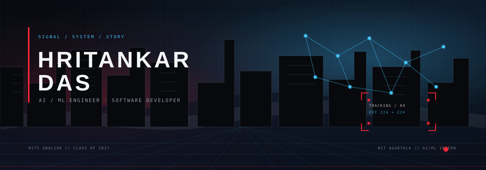
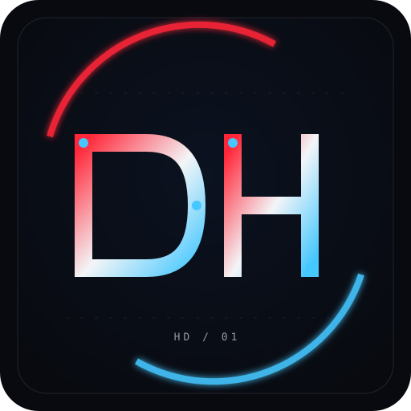
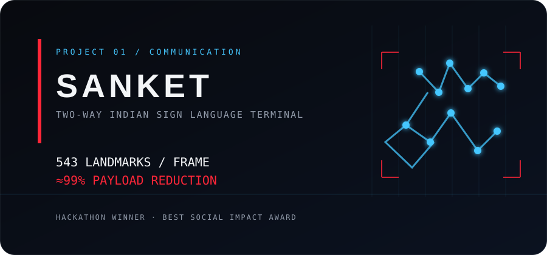
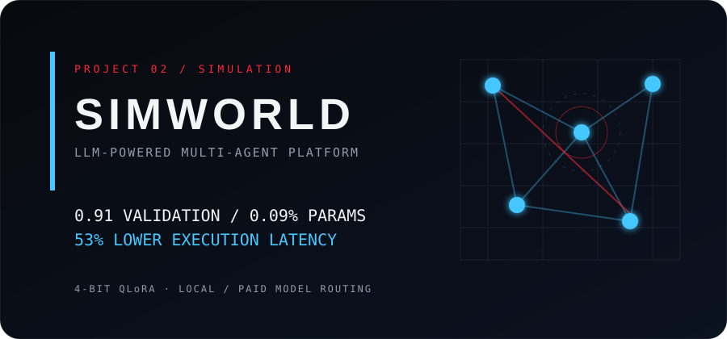
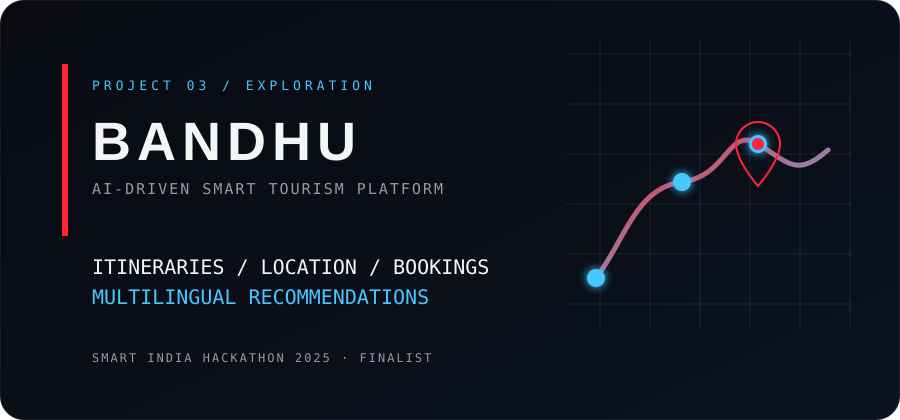
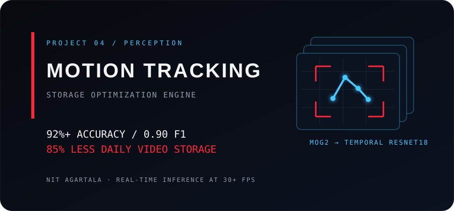
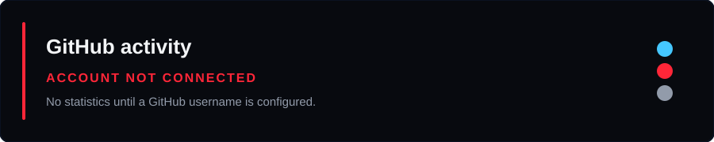

  

  

<h1 align="center">HRITANKAR DAS</h1>

  <strong>Engineering Intelligence. Creating Possibilities.</strong> 
  AI/ML ENGINEER&nbsp;&nbsp;|&nbsp;&nbsp;SOFTWARE DEVELOPER&nbsp;&nbsp;|&nbsp;&nbsp;CREATIVE TECHNOLOGIST

  

  
  
  

  <code>SIGNAL / SYSTEM / STORY</code>

  <a href="#01--about">About</a>&nbsp;&nbsp;•&nbsp;&nbsp;
  <a href="#02--the-stack">The Stack</a>&nbsp;&nbsp;•&nbsp;&nbsp;
  <a href="#03--featured-projects">Projects</a>&nbsp;&nbsp;•&nbsp;&nbsp;
  <a href="#04--experience--recognition">Experience</a>&nbsp;&nbsp;•&nbsp;&nbsp;
  <a href="#05--github-activity">GitHub</a>&nbsp;&nbsp;•&nbsp;&nbsp;
  <a href="#06--the-creative-frame">Creative Frame</a>

  

## 01 — About

<table>
  <tr>
    <td width="22%" valign="top" align="center">
      
    </td>
    <td valign="top">
      

        I am a Computer Science and Engineering student at <strong>Madhav Institute of Technology and Science, Gwalior</strong>, graduating in 2027. I am currently an <strong>AI/ML Intern at NIT Agartala</strong>, building computer-vision systems that connect model intelligence to practical software decisions.
      

      

        My work moves between <strong>AI-driven perception</strong>, <strong>LLM-powered applications</strong>, and full-stack product engineering. I care about the layer where a model becomes a useful, measurable experience: faster inference, smaller payloads, cleaner interfaces and systems that can leave the lab.
      

      

        Outside the codebase, I am the <strong>Vice President of FrameFlicks</strong>, the filmmaking club at MITS Gwalior. That work keeps visual composition, pacing and human storytelling in the same frame as engineering.
      

      
<code>MITS GWALIOR</code>&nbsp;&nbsp; <code>B.TECH CSE</code>&nbsp;&nbsp; <code>CGPA 7.96 / 10</code>

    </td>
  </tr>
</table>

  

### Focus matrix

| SIGNAL | SYSTEM | STORY |
| --- | --- | --- |
| Computer vision · Deep learning · LLMs · RAG | FastAPI · React · Flutter · Firebase · PostgreSQL | Filmmaking · Visual composition · Creative direction |
| Turning frames into landmarks, detections and decisions | Turning models into usable applications and APIs | Turning technical ideas into experiences people can feel |

  

## 02 — The Stack

Tools are selected for the problem in front of me, not collected for decoration.

<table>
  <tr>
    <td width="50%" valign="top">
      <strong>LANGUAGES</strong>  
       
       
      <code>JavaScript (Basics)</code>
    </td>
    <td width="50%" valign="top">
      <strong>AI / MACHINE LEARNING</strong>  
       
      
       
      
       
      
    </td>
  </tr>
  <tr>
    <td width="50%" valign="top">
      <strong>FRAMEWORKS &amp; DEVELOPMENT</strong>  
       
      
    </td>
    <td width="50%" valign="top">
      <strong>TOOLS &amp; FOUNDATIONS</strong>  
       
      <code>DATA STRUCTURES &amp; ALGORITHMS</code>&nbsp; <code>OBJECT-ORIENTED PROGRAMMING</code> 
      <code>OPERATING SYSTEMS</code>&nbsp; <code>DBMS</code>&nbsp; <code>COMPUTER NETWORKS</code> 
      <code>SYSTEM DESIGN (BASICS)</code>
    </td>
  </tr>
</table>

  
<strong>Read the stack as a system</strong>

   

  <table>
    <tr><td><code>PERCEPTION</code></td><td>PyTorch · OpenCV · MediaPipe · TensorFlow.js</td></tr>
    <tr><td><code>REASONING</code></td><td>Deep Learning · LLMs · RAG</td></tr>
    <tr><td><code>SHIP</code></td><td>FastAPI · React · Flutter · Firebase · PostgreSQL · REST APIs</td></tr>
    <tr><td><code>FOUNDATION</code></td><td>C++ · Python · SQL · TypeScript · JavaScript · Linux · Git</td></tr>
  </table>

  

## 03 — Featured Projects

These are the systems I would put on the title card: technically specific, human-facing and built around a measurable constraint.

### PROJECT 01 — SANKET

**Two-Way Indian Sign Language Terminal · Hackathon Winner**

  

Sanket is a two-way Indian Sign Language communication terminal for public service counters. A deaf visitor signs and staff receive text; a typed staff reply is reordered into ISL grammar and rendered back through a Three.js 3D avatar.

`React 18` `TypeScript` `TensorFlow.js` `ONNX Runtime Web` `MediaPipe Holistic` `Three.js` `BiGRU`

| SYSTEM NOTE | RESULT |
| --- | --- |
| On-device representation | 543 landmark coordinates per frame — 33 pose, 21 per hand, 468-point face mesh |
| Privacy / payload | Inference without transmitting camera frames; approximately 99% lower per-frame payload than raw video |
| Sequence model | BiGRU trained on a self-recorded 4,800-clip corpus: 4 signers × 60 signs × 20 repetitions |
| Interaction | Typed replies reordered into ISL grammar and rendered through a 3D avatar timed to 120–250 ms sign peaks |

**Recognition:** Best Social Impact Award at HackSynapse, a national hackathon organized by HackIndia.

> **Repository placeholder:** [REPLACE_WITH_SANKET_REPO](https://github.com/REPLACE_WITH_MY_USERNAME/REPLACE_WITH_SANKET_REPO)

---

### PROJECT 02 — SIMWORLD

**LLM-Powered Multi-Agent Simulation Platform**

  

SimWorld is a real-time multi-agent simulation platform that lets teams test strategic decisions against autonomous LLM agents and forecast 24-hour outcome trajectories.

`Python` `FastAPI` `QLoRA` `Mistral-7B`

| SYSTEM NOTE | RESULT |
| --- | --- |
| Continuous learning | 4-bit QLoRA fine-tuning for domain-specific models |
| Validation | 0.91 validation score while tuning 0.09% of parameters |
| Inference router | Shifts paid API calls to local models when appropriate |
| Operational result | 53% lower execution latency and API execution cost reduced to $0 through local model routing |

> **Repository placeholder:** [REPLACE_WITH_SIMWORLD_REPO](https://github.com/REPLACE_WITH_MY_USERNAME/REPLACE_WITH_SIMWORLD_REPO)

---

### PROJECT 03 — BANDHU

**AI-Driven Smart Tourism Platform**

  

Bandhu connects travellers with verified local guides and regional businesses. Its backend services cover booking management, itinerary generation, multilingual support and real-time location, with recommendations built from user preference and location signals.

`Flutter` `FastAPI` `Firebase` `PostgreSQL` `REST APIs`

| PRODUCT SURFACE | WHAT IT DOES |
| --- | --- |
| Booking management | Connects travellers, guides and regional businesses |
| Itinerary generation | Creates AI-powered travel plans |
| Live context | Supports multilingual experiences and real-time location features |
| Recommendations | Uses user preference and location signals |

**Recognition:** Finalist at Smart India Hackathon (SIH) 2025.

> **Repository placeholder:** [REPLACE_WITH_BANDHU_REPO](https://github.com/REPLACE_WITH_MY_USERNAME/REPLACE_WITH_BANDHU_REPO)

---

### PROJECT 04 — AI-DRIVEN MOTION TRACKING

**AI-Driven Motion Tracking & Storage Optimization Engine · NIT Agartala**

  

A hybrid computer-vision pipeline built during my AI/ML internship at NIT Agartala. MOG2 background subtraction feeds a custom 9-channel temporal ResNet18 classifier; model predictions then drive a dynamic video-storage orchestrator.

`Python` `PyTorch` `OpenCV` `ResNet18`

| SYSTEM NOTE | RESULT |
| --- | --- |
| Classification | 92%+ accuracy and 0.90 F1-score for real-time motion severity classification |
| Storage orchestration | Recording bitrate scales from model predictions, reducing daily video storage consumption by 85% |
| False-positive control | 95% reduction using 9×9 morphological closing, aspect-ratio thresholding and IoU-based merging |
| Inference | 224×224 ROI crops from 1080p frames; 15 epochs; 30+ FPS |

> **Repository placeholder:** [REPLACE_WITH_MOTION_TRACKING_REPO](https://github.com/REPLACE_WITH_MY_USERNAME/REPLACE_WITH_MOTION_TRACKING_REPO)

  

## 04 — Experience & Recognition

<table>
  <tr>
    <td width="22%" valign="top"><code>JUN 2026 — PRESENT</code></td>
    <td valign="top">
      <strong>AI/ML Intern · National Institute of Technology (NIT) Agartala</strong> 
      Architecting a computer-vision motion-tracking and storage-optimization engine with MOG2, a custom 9-channel temporal ResNet18 classifier and real-time ROI inference.
    </td>
  </tr>
  <tr>
    <td width="22%" valign="top"><code>AWARD</code></td>
    <td valign="top">
      <strong>Best Social Impact Award · HackSynapse</strong> 
      Recognized for SANKET at a national hackathon organized by HackIndia.
    </td>
  </tr>
  <tr>
    <td width="22%" valign="top"><code>SIH 2025</code></td>
    <td valign="top">
      <strong>Finalist · Smart India Hackathon (SIH) 2025</strong> 
      Selected for BANDHU from among national-level entries.
    </td>
  </tr>
  <tr>
    <td width="22%" valign="top"><code>LEADERSHIP</code></td>
    <td valign="top">
      <strong>Vice President · FrameFlicks, MITS Gwalior</strong> 
      Lead club operations and event execution across cross-functional teams.
    </td>
  </tr>
  <tr>
    <td width="22%" valign="top"><code>OPERATIONS</code></td>
    <td valign="top">
      <strong>Core Organizing Team · Aarunya, MITS Gwalior</strong> 
      Coordinate planning, logistics and execution across multiple committees for the institute's annual cultural fest.
    </td>
  </tr>
</table>

  

  

## 05 — GitHub Activity

The activity layer is intentionally honest: cards are generated from GitHub data after the username is configured. Until then, the local fallback below is shown instead of invented counts.

<!-- GITHUB-SNAPSHOTS:START -->

  
  
  
  

<!-- GITHUB-SNAPSHOTS:END -->

  Local SVG snapshots keep the profile stable. Run <code>python3 scripts/refresh_stats.py --username REAL_HANDLE</code> after replacing the username. See <a href="./docs/GITHUB-STATS.md">the stats notes</a> for sources, caching and failure behavior.

  <a href="https://github.com/REPLACE_WITH_MY_USERNAME">Open my GitHub profile ↗</a>

  <strong>Featured repository slots:</strong> SANKET · SIMWORLD · BANDHU · MOTION TRACKING — pin the verified repositories after replacing the placeholders above.

  

## 06 — The Creative Frame

<table>
  <tr>
    <td width="18%" valign="top" align="center"><code>FRAME</code></td>
    <td valign="top">Cinematic storytelling · filmmaking · visual composition</td>
  </tr>
  <tr>
    <td width="18%" valign="top" align="center"><code>CUT</code></td>
    <td valign="top">Creative direction · pacing · turning a complex idea into a clear sequence</td>
  </tr>
  <tr>
    <td width="18%" valign="top" align="center"><code>RENDER</code></td>
    <td valign="top">Technology-driven storytelling · interactive experiences · engineering with a point of view</td>
  </tr>
</table>

<blockquote>
  
<strong>I build systems like I edit a film:</strong> find the signal, remove the noise, and make the next frame matter.

</blockquote>

  

  

## 07 — Let's Build Something Intelligent.

  <strong>Have a system worth exploring, a story worth shaping, or a problem worth making visible?</strong>

  
  
  

  Hritankar Das · MITS Gwalior · AI/ML · software · creative technology

<code>END OF SIGNAL // BEGIN THE NEXT FRAME</code>

---

  
<strong>Profile setup — replace these placeholders before publishing</strong>

   

  1. Replace <code>REPLACE_WITH_MY_USERNAME</code> with your real GitHub username everywhere in this README.
  2. Replace <code>REPLACE_WITH_SANKET_REPO</code>, <code>REPLACE_WITH_SIMWORLD_REPO</code>, <code>REPLACE_WITH_BANDHU_REPO</code> and <code>REPLACE_WITH_MOTION_TRACKING_REPO</code> with real repository slugs, or remove those links if the repositories are private/unpublished.
  3. Run the local stats refresh only after the username is set: <code>python3 scripts/refresh_stats.py --username REAL_HANDLE</code>.
  4. Replace any project links with real demo URLs only when you have verified public destinations. No demo links, screenshots or deployments have been invented here.

  
<strong>Compatibility notes</strong>

   

  - The README uses GitHub-compatible Markdown and limited HTML tables, links and image tags; it does not use JavaScript, CSS, iframes or embedded web components.
  - Original SVG artwork is stored in this repository. The scanline and typing line use SVG animation with static first-frame fallbacks; they have no JavaScript or external asset dependency.
  - Dynamic GitHub cards are downloaded as verified, local SVG snapshots. If a service fails, the previous verified snapshot is retained; no numbers are fabricated.
  - For a detailed deployment sequence and the final pre-publish checklist, see [`docs/DEPLOYMENT.md`](./docs/DEPLOYMENT.md).

